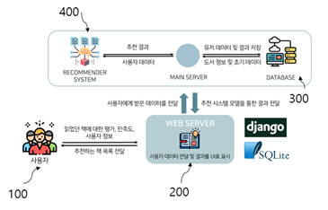

## Machine Learning-based programming book recommendation service


### Licences
**[Jang Hyuksoon](mailto:smashh712@gmail.com), [You Jiwon](mailto:jiwon71@g.cbnu.ac.kr), ZHU HANG.**
 
Computer Engeneering, Chungbuk national University.

### Overview(목적)
이 프로젝트는 프로그래밍 서적으로 공부하는 프로그래머들을 위한  
머신러닝 기반 서적 추천 서비스를 제작하고자 하는 목적이 있다.  
프로그래밍 언어를 익히거나 어떠한 분야에 대한 지식을 습득할 때,  
온라인 강의보다는 주로 기술 서적 혹은 인터넷 검색을 선호하는 것으로 밝혀져 있다.  

많은 학습자가 읽고자 하는 서적을 찾을 때마다, 해당 분야의 대표 서적이나 추천 서적들이 있지만,  
‘나의 수준에 맞고, 나의 목적에 맞는’ 서적을 찾는 데에는 항상 어려움을 겪는다.  
따라서 저희는 이러한 어려움을 어떻게 해결할 수 있을지에 대해서 고민하며 발명을 하게 되었다.  
프로그래머스에서 진행한 ‘개발자가 가장 선호하는 학습 방법’이라는 설문조사에서  
2위를 차지한 것이 ‘기술 서적’이다.  
따라서 해당 추천 서비스를 통해, 많은 개발자 혹은 프로그래밍을 공부하는 사람들에게  
적합한 서적을 찾아주어 개발자 인력 양성에 긍정적인 영향을 줄 것으로 기대된다.  

### Sample Results


## Updates
**11 Dec, 2021**: Initial update

## Architecture
  
=전체 시스템 구성도=

### 의존성
Window 환경에서 Python 3.9, Django(3.2.7) 웹 프레임 워크, MySQL 활용.
Tensorflow2(2.6.0) 라이브러리를 이용

### 사용 방법

* Run with pretrained model
``` (with python 3.7)
python mkrecommend_list.py
python manage.py runserver 0.0.0.0:8000
```

The result image and socre maps will be saved to `./result` by default.

## 기대효과
```
프로그래밍과 컴퓨터 공학 전반을 다루는 도서를 위한 평가와 추천을 제공함으로써  
학생들과 현업 개발자들에게 필요한 도서를 쉽게 고르고 구매할 수 있도록 도와줄 수 있습니다.  
또한, 프로그래밍 서적에 대한 독자적인 평가 지표를 마련하였기 때문에 책에 대한 올바른 평가의 장이 될 수 있습니다.  
따라서 구매자뿐 아니라 책의 저자들이 본인의 책에 대한 건설적인 피드백을 확보할 수 있다는 부가 효과도 있을 것입니다.  

향후, 도서관 확인/대출 기능 혹은 시중 도서 구매 사이트와의 연결 등의 기능을 추가함으로써  
편의를 위한 다양한 기능을 제공할 수 있고,  
추천에 대한 실제 도서 선택 데이터를 더욱 쉽고 정확하게 확보할 수 있을 것으로 기대할 수 있습니다.  
```